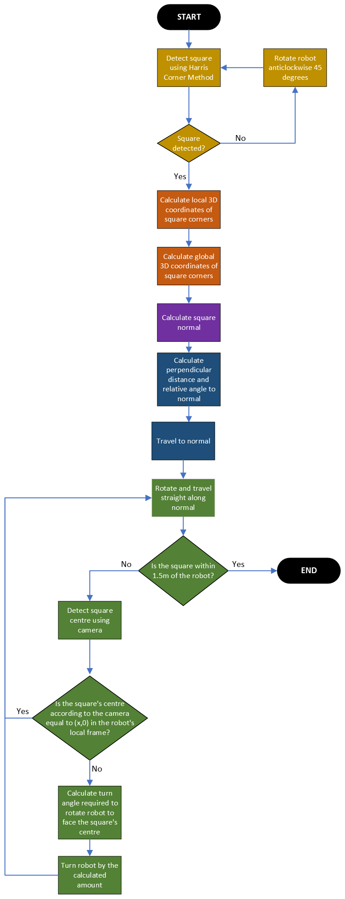

# Turtlebot following a straight line by observing a square

## Project Description
This project utilises C++ and ROS to control a TurtleBot3 Waffle within a simulated Gazebo environment. Equipped with an RGB camera, the robot is able to locate the four corners of a square and navigate to travel in a straight line perpendicular to the square.

## Simulation Setup

<b>Software Requirements: </b>
  - Ubuntu 18.04
  - ROS Melodic
  - Gazebo
  - Visual Studio Code or equivalent editor

<b>Required Turtlebot Repositories: </b>
  - turtlebot3 - https://github.com/ROBOTIS-GIT/turtlebot3.git 
  - turtlebot3_msgs - https://github.com/ROBOTIS-GIT/turtlebot3_msgs.git 
  - turtlebot3_simulation -  https://github.com/ROBOTIS-GIT/turtlebot3_simulations.git

<b>Setting the Turtlebot Model: </b>

This project uses the Turtlebot3 Waffle. To set this model to use in the simulation, edit the bashrc file using the following commands:
1. In the terminal window type: <code>gedit ~/.bashrc </code>
2. Add the following line to the bottom of the bashrc file before saving and closing: <code>export TURTLEBOT3_MODEL=waffle </code>
3. Reload .bashrc by typing the following command in the terminal window: <code>source ~/.bashrc</code>

<b>Launching the simulated environment</b>

To launch our custom environment:
1. Copy the files located in the [] zip folder into the corresponding folders in the following directory: <code>catkin_ws/src/turtlebot3_simulations/turtlebot3_gazebo</code>
2. Ensure the current terminal session is configured to run the new packages by running <code>catkin_make</code>  and <code>source devel/setup.bash</code> in the command window
3. To launch the environment, run the following command in the terminal: <code>roslaunch turtlebot3_gazebo turtlebot3_test.launch</code>

## Code Structure and Logic
### Running the code
To run the code:
1. In the command window, run: <code>catkin_make</code> 
2. In the command window, run: <code>rosrun test_move test_move_sample</code>

### Code Logic
The code logic is summarised in the flowchart below, and can be broken down into five main sections.

1. Square detection: The Harris Corner Detection method is used to detect a square in an image captured by the Turtlebot. The Turtlebot continues to rotate anticlockwise by 45 degrees until four distinct corners are detected within the image. These corners are saved as pixel coordinates and sorted so that the top left, top right, bottom left and bottom right pixel coordinate data are saved in their respective varaibles.
2. Square localisation: The 3D coordinates of the square in the Turtlebot's local coordinate frane are calculated from the image's pixel coordinates using the camera pinhole method. A local to global calculation is then conducted to convert these coordinates from the Turtlebot's local frame to the world's global coordinate frame.
3. Calculation of the square's normal: The square's normal is calculated using the cross product on two vectors calculated by subtracint the x, y and z coordinate values of two pairs of corners. The dot product and trigonometry is used to compute the relative angle between the Turtlebot and the square's normal, as well as the perpendicular distance required to reach the square's normal.
4. Travelling to the square's normal: Once the normal has been computer, the Turtlebot is programmed to rotate to face the normal and travel towards it. Once the Turtlebot reaches the normal, it rotates to face the square, which should be centred on the Turtlebot's camera frame.
5. Travelling straight perpendicular to the square: THe Turtlebot is then programmed to travel towawrds the normal. While the Turtlebot is travelling, the program constantly calculates the relative angle between the square's centre and the Turtlebot camera's centre. If the difference between these centres exceed a certain threshold, the Turtlebot's angular velocity about the z direction is updated so that the Turtlebot would adjust its trajectory to face the centre of the square. The angle by which the angular trajectory is adjusted is calculated using trigonometry to identify the angle needed to rotate the turtlebot so that the camera's centre would align with the square's centre,

### Code Structure
The code contains three classes, each with distinct functionalities:
1. The Sample class commands the Turtlebot to move by publishing <code>/geometry_msgs/Twist</code> messages. The Sample class subscribes to the <code>/camera/rgb/image_raw</code> and <code>/odom</code> topics to receive the Turtlebot's sensor data and positional data respectively. When sensor data needs to be processed, the Sample class creates an object of the LaserProcessing class to perform image analysis on captured images. Depending on the output from the functions called by the LaserProcessing object, the Sample class updates the Turtlebot's trajectory by changing the linear x and y velocities as well as the angular z velocty, and publishing these messages to the <code>/cmd_vel</code> topic. Variables and methods have been outlined in the [sample.h](src/sample.h) header file and implemented in the [sample.cpp](src/sample.cpp) file.
2. The roles of the LaserProcessing class is image processing. The OpenCV library is leveraged to perform Harris Corner Detection on images captured by the Turtlebot. Calculations are then performed within this class to determine the location of detected corners in 3D space using the pinhole camera model. The intrinsic camera parameters were determined by analysing the information displayed when performing <code>rostopic echo /camera/rgb/camera_info</code> in the command terminal. Variables and methods have been outlined in the [laserprocessing.h](src/laserprocessing.h) header file and implemented in the [laserprocessing.cpp](src/laserprocessing.cpp) file.
3. The main class, locating in the [main.cpp](src/main.cpp) file creates a ROS node. A thread is generated on the function test() defined in the Sample class so that the Turtlebot can run its mission in parallel to the main thread. The thread is joined to ensure that the Turtlebot finishes running before the main shuts down.

## Contribution
Brianna Hadiwijaya (13560002): 50%

Katrina Leung (13570181): 50%
